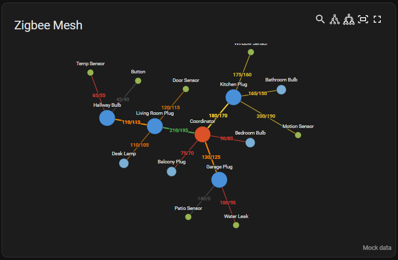
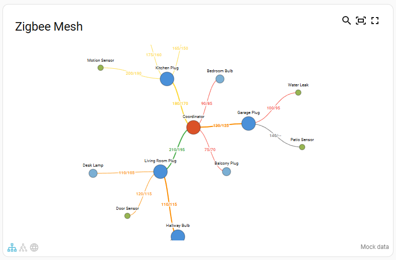
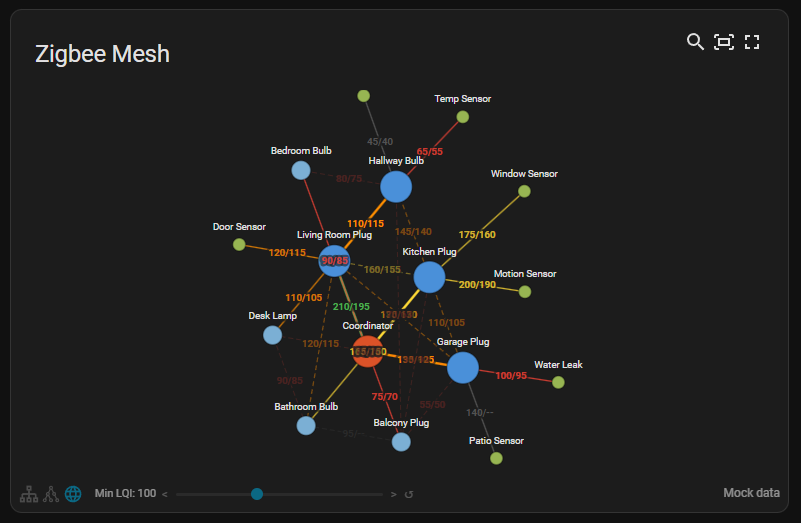

# Zigbee Mesh Map

[](https://github.com/hacs/integration)
[](https://github.com/lubomir-moric/ha-zigbee-mesh-map/releases)
[](ca://s?q=Show_license_info)
[](ca://s?q=Show_repository_stars)

[](https://my.home-assistant.io/redirect/hacs_repository/?owner=lubomir-moric&repository=ha-zigbee-mesh-map&category=plugin)

A modern Lovelace card for Home Assistant that visualizes your Zigbee mesh network from Zigbee2MQTT. Interactive graph with zoom, pan, drag, configurable colors, LQI-based link quality indicators, and automatic updates when the topology changes.

⚠️ **Zigbee2MQTT Only** — this card is not compatible with ZHA or DeCONZ.

## ✨ Features

- Interactive force-directed mesh visualization with zoom, pan, and drag
- Click-to-highlight: click any node to dim everything except its direct connections
- Bidirectional LQI (link quality) display on links
- Color-coded links by signal quality
- Configurable colors, node sizes, fonts, and simulation parameters
- LQI threshold filtering to hide weak links
- Automatic redraw when Zigbee2MQTT publishes a new map
- Manual refresh possibility

### Parent-child view (default)

Shows direct routing connections — the backbone and device-to-router links.

**Dark theme**



**Light theme**



### Full mesh view (`link_filter: all`)

Shows all neighbor/sibling links with the backbone and direct routes emphasised.



## 📦 Installation

### Method 1: The Easy Way (Recommended)
Click the button below to automatically open the repository in HACS:

[](https://my.home-assistant.io/redirect/hacs_repository/?owner=lubomir-moric&repository=ha-zigbee-mesh-map&category=plugin)

### Method 2: Manual Installation
1. Open **HACS** in your Home Assistant.
2. Click the **three dots (⋮)** in the top right corner and select **Custom repositories**.
3. Repository: `https://github.com/lubomir-moric/ha-zigbee-mesh-map`
4. Category: `Lovelace` (or `Plugin`)
5. Click **Add**, then search for "Zigbee Mesh Map Card" to install.

### Method 3: Manual Installation
1. Download `zigbee-mesh-map.js` from the [latest release](https://github.com/lubomir-moric/ha-zigbee-mesh-map/releases)
2. Place it in `/config/www/zigbee-mesh-map/`
3. Add the resource:

```yaml
url: /local/zigbee-mesh-map/zigbee-mesh-map.js
type: module
```

## 📡 Zigbee Network Map Sensor (Required)

You must expose your Zigbee network map as a Home Assistant sensor. Add the following to your `configuration.yaml`:

```yaml
sensor:
  - platform: mqtt
    name: Zigbee2MQTT Network Map
    state_topic: zigbee2mqtt/bridge/response/networkmap
    unique_id: zigbee2mqtt_networkmap
    value_template: "{{ now().strftime('%Y-%m-%d %H:%M:%S') }}"
    json_attributes_topic: zigbee2mqtt/bridge/response/networkmap
    json_attributes_template: "{{ value_json.data.value | tojson }}"
```

## 🧩 Usage

Add the card to your Lovelace dashboard:

```yaml
type: custom:zigbee-mesh-map
entity: sensor.zigbee2mqtt_networkmap
title: Zigbee Mesh
```

### 🔄 Refreshing the Map

Define a script that publishes the Zigbee2MQTT networkmap request. Add this to your `scripts.yaml` (the script key determines the entity ID — `script.zigbee_map_refresh`):

```yaml
zigbee_map_refresh:
  alias: Zigbee map refresh
  sequence:
    - action: mqtt.publish
      data:
        topic: zigbee2mqtt/bridge/request/networkmap
        payload: '{"type":"raw","routes":false}'
```

Alternatively, create the script via **Settings → Automations & Scenes → Scripts → Add Script** in the HA UI. The entity ID is auto-generated from the script name — check it under **Settings → Devices & Services → Entities** and set `refresh_script` in your card config if it differs from the default `script.zigbee_map_refresh`.

Optionally, create an automation to refresh the map periodically (e.g. every hour):

```yaml
alias: "Zigbee: refresh map"
description: Refresh Zigbee map every hour
triggers:
  - hours: /1
    trigger: time_pattern
conditions: []
actions:
  - action: script.zigbee_map_refresh
    metadata: {}
    data: {}
mode: single
```

### ⚙️ Full Configuration

All parameters are optional — if omitted, defaults are used:

```yaml
type: custom:zigbee-mesh-map
entity: sensor.zigbee2mqtt_networkmap
refresh_script: script.zigbee_map_refresh
title: Zigbee Mesh Map
link_filter: parent-child        # "parent-child" or "all"
show_lqi_labels: true            # show LQI values on links
lqi_format: both                 # "both" (XX/YY) or "avg" (single average)
show_node_labels: true           # show friendly names on nodes
coordinator_color: "#DB5228"     # coordinator node color
router_color: "#4A90D9"          # backbone router color (has children)
router_leaf_color: "#7BAFD4"     # leaf router color (no children)
end_device_color: "#97B552"      # end device node color
node_outline_color: "rgba(0,0,0,0.3)"  # "none", "#fff", "gray"
font_size: 6                     # label font size in pixels
min_lqi: 0                       # LQI threshold for weak links
min_lqi_mode: dim                # "dim" (fade weak links) or "remove" (hide them)
node_radius:
  coordinator: 10                # coordinator node radius
  router: 10                     # backbone routers (have children)
  router_leaf: 6                 # leaf routers (no children)
  end_device: 4                  # end device node radius
lqi_colors:
  200: "#4CAF50"                 # >=200 excellent (green)
  150: "#FDD835"                 # >=150 good (yellow)
  100: "#FB8C00"                 # >=100 fair (orange)
  50: "#F44336"                  # >=50 poor (red)
  0: "#5F5F5F"                   # <50 very poor (gray)
zoom:
  min: 0.2                       # minimum zoom level
  max: 4                         # maximum zoom level
  initial: auto                  # "auto" (fit after initial settle) or number (e.g. 1.5)
link_style:
  backbone_width: 1.5            # backbone links (between core routers)
  backbone_opacity: 1
  backbone_dash: ""              # "" = solid
  route_width: 0.8               # route links (to leaf routers / end devices)
  route_opacity: 0.7
  route_dash: ""
  neighbor_width: 0.5            # neighbor links (relationship: 2, non-routing)
  neighbor_opacity: 0.3
  neighbor_dash: "3,2"           # SVG stroke-dasharray pattern
  dim_width: 0.5                 # weak link thickness (below min_lqi)
  dim_opacity: 0.25              # weak link opacity (below min_lqi)
force_config:
  link_distance: 30              # ideal link length (higher = more spread)
  link_strength: 0.8             # how rigidly links hold distance (0–1)
  charge_strength: -20           # node repulsion (more negative = stronger)
  collide_radius: 25             # minimum spacing between nodes
  alpha_decay: 0.04              # simulation cooldown speed (lower = longer settle)
layout_options:
  grid_columns: 4                # default card width in grid units
  grid_rows: 8                   # default card height in grid units
```

You only need to specify the parameters you want to change. For nested objects (`node_radius`, `lqi_colors`, `force_config`, `zoom`, `layout_options`), partial overrides are supported — unspecified keys keep their defaults.

The card automatically fills the space assigned by HA's grid layout. Use `layout_options` to control the default size, or resize the card directly in the dashboard editor.

## 🛠 Requirements

- Home Assistant 2023.0+
- Zigbee2MQTT with `networkmap` enabled
- MQTT integration configured in HA

## 🧪 Troubleshooting

**The map does not refresh:**
- Ensure your script publishes `{"type":"raw","routes":false}`
- Check Zigbee2MQTT logs for map generation errors
- Verify the entity updates in Developer Tools → States

**Routing table errors:**
- Normal for many Tuya/Telink routers (e.g., TS011F)
- They do not support routing table queries

**Warning banner in the card:**
- "Entity not found" — check that `entity` matches your sensor's entity ID
- "Does not contain expected data"
  - verify your MQTT sensor template outputs `nodes` and `links` arrays
  - **After a Home Assistant reboot:** The map entity may be empty. Use the manual refresh button or create an automation to refresh the map data on system startup.
    ```yaml
    # Example Automation
    alias: "Refresh Zigbee Map on Startup"
    trigger:
      - platform: homeassistant
        event: start
    action:
      - service: script.zigbee_map_refresh
    ```
- "Refresh script not found" — create the script or set `refresh_script` to match your script's entity ID

**Testing without real data:**
- Add `mock_data: true` to your card config to render with built-in sample data
- Useful for testing layout, colors, and configuration options without a live Zigbee network
- Remove `mock_data` when done

## 📄 License

MIT No Attribution (MIT-0)

## ✨ AI-Generated Project

This project was created with assistance from AI tools. Code and documentation were generated through iterative AI-guided development, then manually reviewed and refined.
