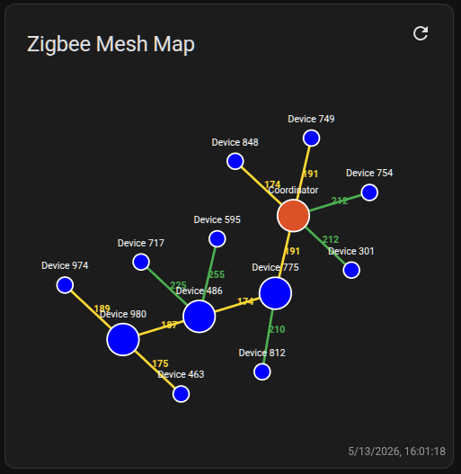

# ha-zigbee-mesh-map

[](https://github.com/hacs/integration)
[](https://github.com/lubomir-moric/ha-zigbee-mesh-map/releases)
[](ca://s?q=Show_license_info)
[](ca://s?q=Show_repository_stars)

ha-zigbee-mesh-map is a modern Lovelace card for Home Assistant that visualizes your Zigbee mesh network from Zigbee2MQTT.  It provides an interactive graph, manual refresh, smooth animations, automatic updates when the topology changes, and a clean HA-native UI.

## ✨ Features

- Interactive Zigbee mesh visualization (nodes + links)
- Automatic redraw when Zigbee2MQTT publishes a new map
- Manual refresh button with animations
- "Refreshing..." status indicator
- Smooth map transition effects
- Works with any Zigbee2MQTT `networkmap` entity
- Lightweight, no external dependencies



## 📦 Installation

### HACS (Custom Repository)
1. Open HACS – Frontend – Custom repositories
2. Add:
- URL: https://github.com/lubomir-moric/ha-zigbee-mesh-map
- Category: Lovelace
3. Install Zigbee Mesh Map Card
4. Add the resource manually if needed:

url: /hacsfiles/ha-zigbee-mesh-map/zigbee-mesh-map.js
type: module

### Manual Installation
1. Download `zigbee-mesh-map.js` from the latest release
2. Place it in:

```
/config/www/zigbee-mesh-map/
```
3. Add the resource:

url: /local/zigbee-mesh-map/zigbee-mesh-map.js
type: module

##  🧩 Usage

Add the card to your Lovelace dashboard:

```yaml
type: custom:zigbee-mesh-map
entity: sensor.zigbee2mqtt_networkmap
title: Zigbee Mesh
```

### 🔄 Refreshing the Map

Define a script in Home Assistant that publishes the Zigbee2MQTT networkmap request (Note: `alias` must be named exactly as shown in example below!):

```yaml
sequence:
  - action: mqtt.publish
    metadata: {}
    data:
      topic: zigbee2mqtt/bridge/request/networkmap
      payload: "{\"type\":\"graphviz\",\"routes\":true}"
alias: Zigbee map refresh
```
Optionally create automation which executes this script e.g. every hour:

```yaml
alias: "Zigbee: refresh map"
description: Refresh Zigbee map every hour
triggers:
  - hours: /1
    trigger: time_pattern
conditions: []
actions:
  - action: script.zigbee_map_refresh
    metadata: {}
    data: {}
mode: single
```

##  🛠 Requirements

- Home Assistant 2023.0+
- Zigbee2MQTT with `networkmap` enabled
- MQTT integration configured in HA

###  🧪 Troubleshooting

The map does not refresh:
- Ensure your script publishes {"type":"graphviz","routes":true}}
- Check Zigbee2MQTT logs for map generation errors
- Verify the entity updates in Developer Tools – States

Routing table errors:
- Normal for many Tuya/Telink routers (e.g., TS011F)
- They do not support routing table queries

##  📄 License

MIT No Attribution (MIT-0)

## ✨ AI‑Generated Project
This project was created with extensive assistance from AI tools.
Most of the code, structure, and documentation were generated through iterative AI‑guided development and then manually reviewed, adjusted, and refined.
